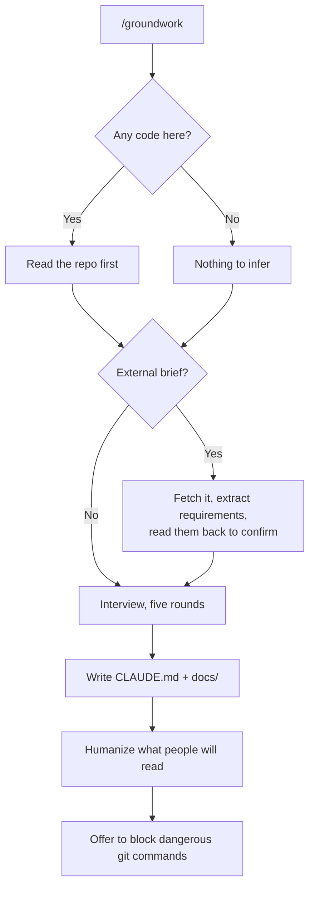

# groundwork

A Claude Code skill that gives a project a memory.

You answer questions once. It writes the notes. Every session after that already knows your project, your rules, and where you left off.

## The problem

Open a new chat and the agent knows nothing. It doesn't know what you're building, that you hate four-level nesting, or that you already tried Redis and dropped it. So you explain. Next week you explain again.

Groundwork writes all of that down once, in files the agent reads on its own.

## How it runs



## What it writes

```
CLAUDE.md              read every session, capped around 60 lines
docs/
  brief.md             only when there's an external brief
  overview.md          what this is and who it's for
  architecture.md      how it's built, and what you rejected
  standards.md         taste, testing, prose voice, security
  progress.md          where you are now
  changes.md           append-only decision log
  handoffs/            session notes, one file per stop
```

Only `CLAUDE.md` loads every session, which is why it stays small. It holds your rules and an index. The rest gets opened when it's relevant and costs nothing the rest of the time.

## The interview

Five rounds, three questions at a time, about fifteen minutes.

It reads your repo before asking anything, so it confirms rather than interrogates. It won't ask what test framework you use when `package.json` already says. Say `skip` to any round and it writes `Not yet defined` instead of inventing an answer.

It also asks what you *dislike*. That turns out to be sharper than what you like.

## Working from a brief

Hackathon rules, a client brief, a course assignment, a problem statement. Paste a link, a repo, a PDF or a Word file and it does the reading.

It pulls out deliverables, mandated technology, disqualifying constraints, judging criteria, deadlines and submission format — then reads the extraction back before believing any of it, because briefs are often vague and a misread constraint poisons every file downstream.

Mandated rules land in `CLAUDE.md` under their own non-negotiable heading. Your preferences can be traded off for a better engineering call. These can't.

Requirements become a checklist. `sync` ticks items off, and `review` reports unmet mandated requirements before anything else.

## Modes

| Command | Does |
|---|---|
| `/groundwork` | Set up a project. Once. |
| `/groundwork sync` | Update progress and change log from git |
| `/groundwork review` | Check notes against reality |
| `/groundwork rules` | Revisit just the rules |
| `/groundwork brief` | Attach a brief to an existing project |

## Install

```bash
npx skills add divyanshjoshii/groundwork -g
```

`-g` makes it available in every project, including ones that don't exist yet.

## Companion skills

**Groundwork works with none of these installed.** The interview and the files are self-contained. Each one below adds a step, and anything missing is skipped quietly — it will never interrupt an interview to suggest an install.

| Skill | Adds | Install |
|---|---|---|
| [humanizer](https://github.com/blader/humanizer) | Prose that reads like you wrote it, not like a model | `npx skills add blader/humanizer -g` |
| [handoff](https://github.com/mattpocock/skills) | Session notes when you stop mid-work | see below |
| [domain-modeling](https://github.com/mattpocock/skills) | Sharper architecture notes and decision records | see below |
| [writing-for-agents](https://github.com/mattpocock/skills) | Better conventions for agent-facing markdown | see below |
| [git-guardrails](https://github.com/mattpocock/skills) | Actually blocks `push`, `reset --hard`, `branch -D` | see below |

The middle four all live in one collection:

```bash
npx skills add mattpocock/skills -g
```

**Be aware that installs around 37 skills, not four.** Claude Code gives the skill list a limited slice of context and silently drops descriptions when it overflows, so a large collection can quietly stop other skills from firing. Install it if you want the whole set. Otherwise skip these four — groundwork works without them.

`pdf` and `docx` are needed only for briefs in those formats. Both are first-party Anthropic skills you enable in your claude.ai settings rather than installing here.

## Pairs well with

[ship](https://github.com/divyanshjoshii/ship) — commit and push with every step confirmed. Groundwork writes the rules; ship checks your work against them before it reaches GitHub.

## Hard rules and soft rules

Worth understanding, because most setups get it wrong.

A rule in `CLAUDE.md` is read every session and followed, but it can slip in a long one. A hook physically blocks the command and cannot be talked around.

*Prefer small functions* is soft. *Never push without asking* is hard, and belongs in a hook. Groundwork offers to set that up when you name something as non-negotiable, and never wires a hook without you saying yes.

## Requirements

Claude Code, and git for the `sync` mode.

## Licence

MIT
