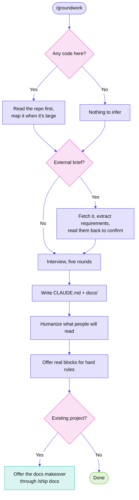

# groundwork

A Claude Code skill that gives a project a memory.

You answer questions once. It writes the notes. Every session after that already knows your project, your rules, and where you left off.

## The problem

Open a new chat and the agent knows nothing. It doesn't know what you're building, that you hate four-level nesting, or that you already tried Redis and dropped it. So you explain. Next week you explain again.

Groundwork writes all of that down once, in files the agent reads on its own.

## How it runs

<!-- Diagram colours: ship's neutral palette, since this repository has no stylesheet or logo. -->



## What it writes

```
CLAUDE.md              read every session, capped around 60 lines
docs/
  brief.md             only when there's an external brief
  overview.md          what this is and who it's for
  architecture.md      how it's built, and what you rejected
  standards.md         taste, testing, prose voice, security
  progress.md          where you are now
  changes.md           append-only decision log
  handoffs/            session notes, one file per stop
```

Only `CLAUDE.md` loads every session, which is why it stays small. It holds your rules and an index. The rest gets opened when it's relevant and costs nothing the rest of the time. Your progress notes and the latest handoff get read when a session picks up earlier work; a quick question skips them.

The skill keeps its own instructions small the same way: `sync`, `review` and `rules` load a short file, and the long setup instructions load only during setup.

## The interview

Five rounds, three questions at a time, about fifteen minutes.

It reads your repo before asking anything, so it confirms rather than interrogates. It won't ask what test framework you use when `package.json` already says. Say `skip` to any round and it writes `Not yet defined` instead of inventing an answer.

It also asks what you *dislike*. That turns out to be sharper than what you like.

The rules round also settles how work reaches GitHub: a branch and pull request per change or straight to the default branch, and whether commits carry any AI attribution. [ship](https://github.com/divyanshjoshii/ship) reads the answer before every push, and leaves merging your pull requests to you.

## Working from a brief

Hackathon rules, a client brief, a course assignment, a problem statement. Paste a link, a repo, a PDF or a Word file and it does the reading.

It pulls out deliverables, mandated technology, disqualifying constraints, the rules on AI use, judging criteria, deadlines and submission format, then reads the extraction back before believing any of it. If the brief says AI help must be disclosed, that becomes a non-negotiable rule, and ship writes the disclosure into your pull requests. Briefs are often vague, and a misread constraint poisons every file downstream.

Mandated rules land in `CLAUDE.md` under their own non-negotiable heading. Your preferences can be traded off for a better engineering call. These can't.

Requirements become a checklist. `sync` ticks items off, and `review` reports unmet mandated requirements before anything else.

## Existing projects

On a project with around 100 source files or more, groundwork maps the code before the interview with [Graphify](https://github.com/Graphify-Labs/graphify). The map is built locally from the code alone, with no API key and no model calls. It shows the most connected pieces, the surprising links between files, and how the code clusters, so the architecture notes start from what's there. The full map stays in `graphify-out/`, which gets gitignored, and `review` refreshes it to check the notes haven't drifted.

The last step offers a one-time docs makeover through [ship](https://github.com/divyanshjoshii/ship). The README gets diagrams drawn from the real code, in the project's own colours, plus a logo header and badges, and its prose is rewritten to sound like you. Run it in a fresh session: it reads every doc, and after a long interview each read costs more. You see the diff before anything is committed.

Without ship installed, groundwork mentions `/ship docs` once and stops there.

## Modes

| Command | Does |
|---|---|
| `/groundwork` | Set up a project. Once. |
| `/groundwork sync` | Update progress and change log from git |
| `/groundwork review` | Check notes against reality |
| `/groundwork rules` | Revisit just the rules |
| `/groundwork brief` | Attach a brief to an existing project |

## Install

```bash
npx skills add divyanshjoshii/groundwork -g
```

`-g` makes it available in every project, including ones that don't exist yet.

## Companion skills

**Groundwork works with none of these installed.** The interview and the files are self-contained. Each one below adds a step, and anything missing is skipped quietly. It will never interrupt an interview to suggest an install.

| Skill | Adds | Install |
|---|---|---|
| [humanizer](https://github.com/blader/humanizer) | Prose that reads like you wrote it, not like a model | `npx skills add blader/humanizer -g` |
| [handoff](https://github.com/mattpocock/skills) | Session notes when you stop mid-work | see below |
| [domain-modeling](https://github.com/mattpocock/skills) | Sharper architecture notes and decision records | see below |
| [writing-for-agents](https://github.com/mattpocock/skills) | Better conventions for agent-facing markdown | see below |
| [git-guardrails](https://github.com/mattpocock/skills) | Actually blocks `push`, `reset --hard`, `branch -D` | see below |

The middle four all live in one collection:

```bash
npx skills add mattpocock/skills -g
```

**Be aware that this installs around 37 skills, not four.** Claude Code gives the skill list a limited slice of context and silently drops descriptions when it overflows, so a large collection can stop other skills from firing without telling you. Install it if you want the whole set. Otherwise skip these four, since groundwork works without them.

`pdf` and `docx` are needed only for briefs in those formats. Both are first-party Anthropic skills you enable in your claude.ai settings rather than installing here.

## Tools it offers once

During the standards round, groundwork checks for a few machine-wide tools and mentions only the missing ones. Say no and it won't ask again.

| Tool | Why |
|---|---|
| A language server | Finds real callers before code changes, so fewer wrong edits |
| Context7 | Current library docs instead of whatever the model remembers |
| [GitHub CLI](https://cli.github.com) | Pull requests and the inbox in ship |
| [RTK](https://github.com/rtk-ai/rtk) | Shorter command output, so long sessions keep more room for the work |
| [Graphify](https://github.com/Graphify-Labs/graphify) | The code map for large existing projects |

## Pairs well with

[ship](https://github.com/divyanshjoshii/ship) handles commit and push with every step confirmed. Groundwork writes the rules, and ship checks your work against them before it reaches GitHub.

## Hard rules and soft rules

Worth understanding, because most setups get it wrong.

A rule in `CLAUDE.md` is read every session and followed, but it can slip in a long one. A real block stops the action before it happens and cannot be talked around.

*Prefer small functions* is soft. *Never push without asking* is hard.

Hard rules get routed by what they actually are. Git operations go to a hook. Everything else, like deleting files or reading a secret, goes to deny rules in `.claude/settings.json`, which block the tool call with no hook script involved. Most hard rules people name turn out to be the second kind, and a git hook does nothing for those.

Groundwork offers whichever fits when you name something non-negotiable, and writes neither without you saying yes.

## Requirements

Claude Code, and git for the `sync` mode.

## Licence

MIT
